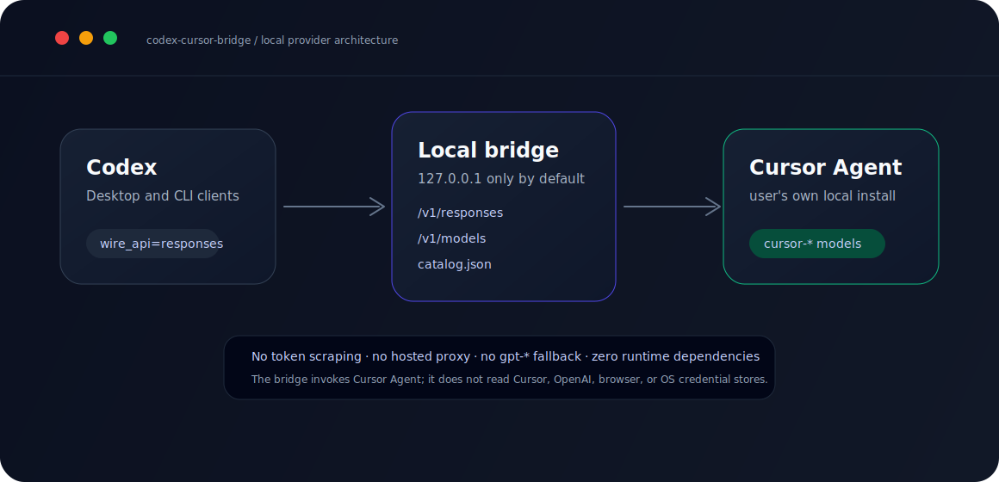
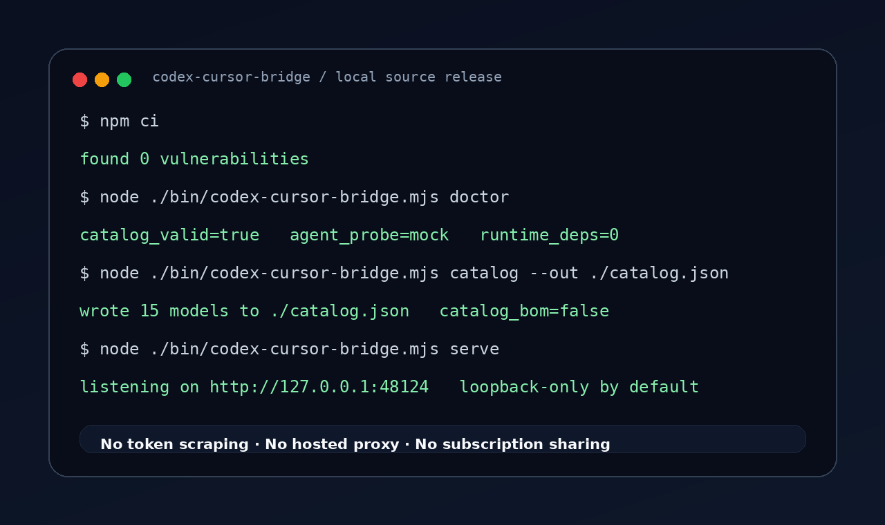
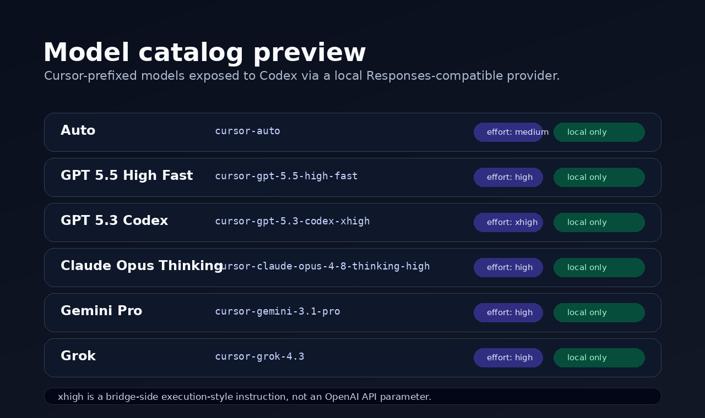
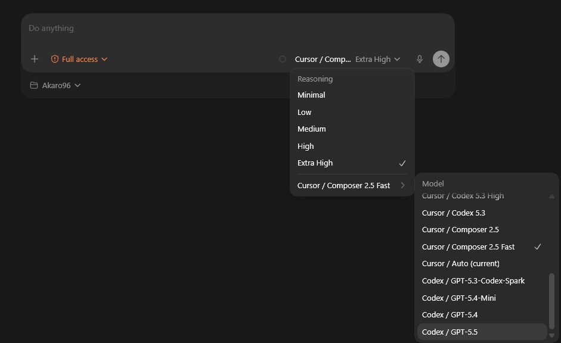
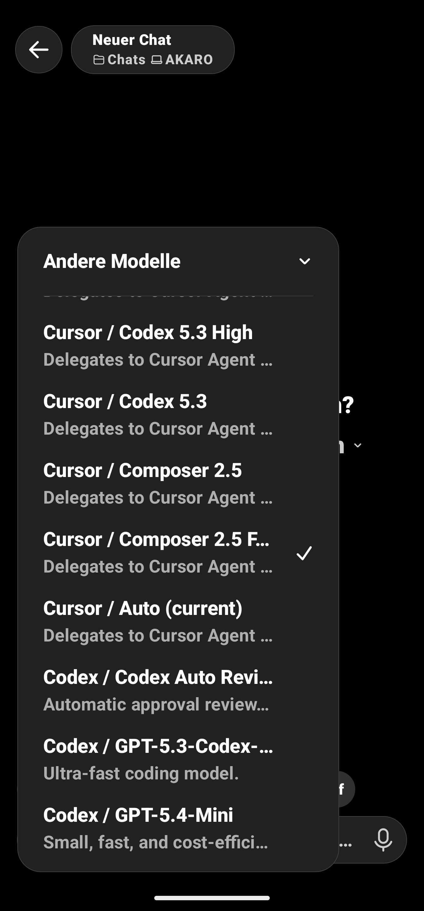

# Codex Cursor Bridge

[](https://github.com/Akaro96/codex-cursor-bridge/actions/workflows/ci.yml)
[](https://github.com/Akaro96/codex-cursor-bridge/actions/workflows/secret-scan.yml)


Codex Cursor Bridge is a small local Node program that lets OpenAI Codex call models from your own Cursor Agent installation through Codex's custom-provider mechanism. It binds to `127.0.0.1`, ships with zero runtime dependencies, and does not touch your credentials.



> [!IMPORTANT]
> This is an AI-generated / AI-assisted v0.1.0 source release, not a battle-tested production integration. The initial code and documentation were prepared primarily with AI assistance under human direction and reviewed with automated tests. Linux and Windows have been exercised locally; macOS is covered by CI and spawn tests, but a real Mac Cursor-Agent smoke test is still recommended before a public npm release.

You run the bridge on your own machine, with your own Codex installation and your own Cursor Agent login. The maintainer does not host, proxy, log, relay, or provide infrastructure for model traffic.

Not a hosted proxy. Not a subscription-sharing tool. Not a credential extraction tool. See [SECURITY.md](SECURITY.md), [DISCLAIMER.md](DISCLAIMER.md), and [docs/THREAT_MODEL.md](docs/THREAT_MODEL.md).

## Status

- Public source release: v0.1.0.
- Limited real-world testing: Linux and Windows exercised locally; macOS is CI/spawn-test only until a real Mac smoke test runs.
- Local-only by design: default bind is `127.0.0.1`; no hosted proxy mode.
- Provided as-is under the MIT License, without warranty.

## Contents

- [What it does](#what-it-does)
- [Screenshots](#screenshots)
- [Quick start](#quick-start)
- [Codex configuration](#codex-configuration)
- [Verified on](#verified-on)
- [Ownership and package naming](#ownership-and-package-naming)
- [FAQ](docs/FAQ.md)
- [Support](SUPPORT.md)
- [Development](#development)
- [Security model](#security-model)
- [No warranty](#no-warranty)
- [License](#license)

## What it does

`codex-cursor-bridge serve` starts a local Responses-compatible provider. Point Codex at `http://127.0.0.1:48124/v1`, generate the model catalog, and select `cursor-auto` or another `cursor-*` model from Codex's model picker.

| In v0.1.0 | Out of scope |
|---|---|
| Codex `wire_api = "responses"` provider | Hosted / multi-user proxy mode |
| Cursor Agent subprocess execution for `cursor-*` models | Token, cookie, keychain, or browser-store reads |
| Static `model_catalog_json` for Codex's picker | Subscription sharing or quota resale |
| Reasoning effort mapping: `minimal`, `low`, `medium`, `high`, `xhigh` (`xhigh` is a bridge-side execution-style instruction, not an OpenAI API parameter) | Silent `gpt-*` to Cursor fallback |
| Windows, macOS, and Linux CI matrix | Streaming Responses/SSE |

## Screenshots

### Real terminal output



### Catalog preview



### Native model pickers

Real screenshots from Codex Desktop and the mobile ChatGPT/Codex picker, re-encoded without image metadata. The mobile capture is only cropped at the top to remove the Android notification/status strip; the app UI itself is left intact so visitors can see how the native model list appears in practice.

| Codex Desktop | Mobile ChatGPT/Codex |
|---|---|
|  |  |

The terminal image is rendered from privacy-safe local CLI output. The catalog preview is generated from the package's model catalog. The native picker screenshots are from a local setup and contain no tokens, private paths, or hidden metadata.

## Quick start

### 1. Install prerequisites

- Node.js 20 or newer
- Codex CLI or Codex Desktop App with custom model-provider support
- Cursor Agent CLI installed and logged in on the same machine

Cursor Agent should be reachable as `agent` or `cursor-agent`. If your command has another path, set `CURSOR_AGENT_COMMAND`. `CURSOR_AGENT_PATH` is accepted as a deprecated legacy alias.

On Linux, `agent` can collide with unrelated tools. Prefer the full Cursor Agent path printed by Cursor's installer, for example `~/.local/bin/cursor-agent` or another explicit path on your machine.

```bash
export CURSOR_AGENT_COMMAND=/absolute/path/to/agent
```

Windows PowerShell:

```powershell
$env:CURSOR_AGENT_COMMAND = "C:\Path\To\agent.cmd"
```

### 2. Install or run from source

The npm package is not published yet. Clone the public repository and run the local binary:

```bash
git clone https://github.com/Akaro96/codex-cursor-bridge.git
cd codex-cursor-bridge
npm ci
node ./bin/codex-cursor-bridge.mjs doctor
```


After an intentional npm publication, the planned command is:

```bash
npx @codex-cursor-bridge/cli doctor
```

### 3. Start the bridge

From source:

```bash
node ./bin/codex-cursor-bridge.mjs serve
```

After intentional npm publication:

```bash
npx @codex-cursor-bridge/cli serve
```

Default endpoint:

```text
http://127.0.0.1:48124/v1/responses
```

The bridge intentionally binds to loopback by default. Binding to `0.0.0.0` is possible but not recommended and prints a warning.

### 4. Generate a model catalog

From source:

```bash
node ./bin/codex-cursor-bridge.mjs catalog --out ~/.codex/codex-cursor-model-catalog.json
```

After intentional npm publication:

```bash
npx @codex-cursor-bridge/cli catalog --out ~/.codex/codex-cursor-model-catalog.json
```

Use an absolute path in Codex config. The file is written as UTF-8 JSON without BOM. Copy the exact path you passed to `catalog --out`; do not guess or use `~` inside `model_catalog_json`.

## Codex configuration

Merge this snippet into your existing Codex config and restart Codex. **Do not overwrite an existing config file.**

```toml
model = "cursor-auto"
model_provider = "cursorbridge"
model_catalog_json = "/absolute/path/you/used/with/catalog--out/codex-cursor-model-catalog.json"

[model_providers.cursorbridge]
name = "Cursor Bridge"
base_url = "http://127.0.0.1:48124/v1"
wire_api = "responses"
requires_openai_auth = false
experimental_bearer_token = "local"
supports_websockets = false
request_max_retries = 1
stream_max_retries = 0
stream_idle_timeout_ms = 300000
```

`experimental_bearer_token = "local"` is a local placeholder for Codex clients that expect a token-shaped field. The field name comes from Codex's config schema, not from this bridge. The bridge does not inspect, validate, or forward Authorization headers.

## Verified on

| Platform | Status | Notes |
|---|---|---|
| Linux x64, Node 20 | Passing | Full local suite, release check, npm pack dry run, npm audit. |
| Windows 11, Node 24 | Passing | Fresh temp extraction, full test suite, release check, npm pack dry run, real Cursor Agent one-shot returned `OK`. |
| macOS latest, Node 20/22/24 | CI-only | Covered by GitHub Actions matrix and `darwin` spawn tests. Not yet hardware-smoke-tested with a real Mac Cursor Agent. |

## Ownership and package naming

The public source repository lives at `github.com/Akaro96/codex-cursor-bridge`. The planned npm package name is `@codex-cursor-bridge/cli`, but npm publication is intentionally separate and not required to run from source. The package/repo name does not imply ownership, endorsement, or official support by OpenAI, Cursor, or Anysphere.

For now this is a small personal-account OSS project under `Akaro96`. If it grows, it can later move to a neutral GitHub organization. See [docs/OWNERSHIP.md](docs/OWNERSHIP.md).

## Development

```bash
git clone https://github.com/Akaro96/codex-cursor-bridge.git
cd codex-cursor-bridge
npm ci
npm run test:ci
npm run release:check
```


Core tests use Node's built-in `node:test` runner. There are no runtime dependencies.

OS-specific setup notes:

- [Windows](docs/INSTALL-Windows.md)
- [macOS](docs/INSTALL-macOS.md)
- [Linux](docs/INSTALL-Linux.md)

## Security model

The bridge is deliberately narrow:

- loopback-only by default,
- `cursor-*` models only by default,
- explicit subprocess arguments, no `shell: true`,
- bounded request body size,
- abort handling that kills the Cursor Agent subprocess,
- temporary prompt directories cleaned in `finally`,
- security-boundary tests for credential-store scraping primitives.

### Subprocess flags you are opting into

The bridge launches Cursor Agent with explicit local-agent flags so delegated coding tasks can run end-to-end:

- `--force` executes without interactive confirmation prompts.
- `--sandbox disabled` runs without Cursor Agent's sandbox.
- `--approve-mcps` auto-approves MCP servers discovered by Cursor Agent.
- `--trust` treats the selected workspace as trusted.

Because of these flags, only point `--workspace` at directories you trust the agent to read and modify. Do not run the bridge against your home directory, filesystem root, or shared/network mounts. If you need stronger isolation, do not use this bridge yet; v0.1.0 is a convenience layer, not a hardened sandbox.

`CODEX_CURSOR_BRIDGE_MOCK=1` is for CI and local tests only. It bypasses Cursor Agent and returns a canned response, so do not set it in real workflows.

See [docs/THREAT_MODEL.md](docs/THREAT_MODEL.md) for the full trust-boundary map.

## Research and prior art

See [docs/RESEARCH.md](docs/RESEARCH.md). The nearby ecosystem has CLI-to-API proxies and multi-agent gateways; this project focuses on Codex-native model-catalog integration for Cursor Agent models.

## No warranty

This project is provided "as is", without warranty of any kind, under the MIT License. You are responsible for complying with the terms that apply to Codex, Cursor, Cursor Agent, OpenAI, and your organization. See [DISCLAIMER.md](DISCLAIMER.md).

## License

MIT. See [LICENSE](LICENSE) and [NOTICE](NOTICE).
